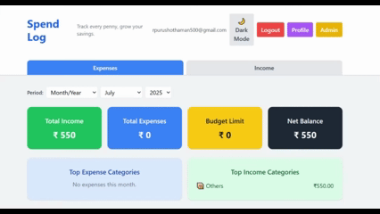

# 💸 Spend Log

[](https://spend-log.netlify.app/)

[](https://app.netlify.com/projects/spend-log/deploys)

_Track every penny, grow your savings._

Spend Log is a modern, full-stack web app for managing your daily expenses and income. Built with **React** (frontend) and **Node.js/Express + MongoDB** (backend), it features secure authentication, persistent storage, and a beautiful, responsive UI.

---

## 🎬 Live Demo



---

## ✨ Features

- 🔐 **Authentication:** Register, login, email verification, and password reset
- 💸 **Expense & Income Tracking:** Add, edit, and delete entries
- 🔎 **Smart Filters:** Filter and search by category, date, or name
- 📊 **Visual Reports:** Pie, bar, and trend charts with Chart.js
- 🎯 **Budgeting:** Set and visualize a monthly budget
- 📤 **Export:** Download your data as CSV or PDF
- 🌙 **Dark Mode:** Beautiful, accessible design for day or night
- 🛡️ **Security:** JWT authentication, password hashing, rate limiting, and more

---

## 🛠️ Tech Stack

- **Frontend:** React, Tailwind CSS, Chart.js
- **Backend:** Node.js, Express, MongoDB (Mongoose)
- **Security:** JWT, bcrypt, helmet, express-rate-limit, xss-clean
- **Docs:** Swagger (API docs at `/api-docs`)

---

## 📁 Project Structure

```
├── backend/         # Express API & MongoDB models
│   ├── routes/
│   ├── models/
│   ├── middleware/
│   └── server.js
├── client/          # React frontend
│   ├── src/
│   └── public/
├── assets/          # Images, screenshots
├── screencapture.gif # Demo animation
├── .gitignore
├── README.md
└── ...
```

---

## 🚀 Getting Started

### 1. **Clone the repository**
```bash
git clone https://github.com/FrontEndExplorer-Temp/spend-log.git
cd spend-log
```

### 2. **Set up environment variables**
Create a `.env` file in the `backend/` directory:
```env
MONGO_URI=your_mongodb_atlas_connection_string
JWT_SECRET=your_jwt_secret
JWT_REFRESH_SECRET=your_jwt_refresh_secret
MAIL_HOST=your_smtp_host
MAIL_PORT=your_smtp_port
MAIL_USER=your_email_user
MAIL_PASS=your_email_password
MAIL_FROM=your_from_email
CORS_ORIGIN=http://localhost:3000
FRONTEND_URL=http://localhost:3000
```
**Never commit your `.env` file!**

### 3. **Install dependencies**
```bash
cd backend && npm install
cd ../client && npm install
```

### 4. **Run the backend**
```bash
cd backend
node server.js
# or use nodemon for development
```

### 5. **Run the frontend**
```bash
cd client
npm start
```

- Frontend: http://localhost:3000
- Backend API: http://localhost:5000

---

## 🌐 Deployment
- **Frontend:** Deploy to [Netlify](https://netlify.com) or [Vercel](https://vercel.com)
- **Backend:** Deploy to [Render](https://render.com), [Railway](https://railway.app), or [Heroku](https://heroku.com)
- **MongoDB:** Use [MongoDB Atlas](https://www.mongodb.com/atlas) (free tier)
- **Set environment variables** in your host’s dashboard (never commit secrets)

---

## 🔒 Security & Best Practices
- `.gitignore` protects `.env`, `node_modules`, and build files
- Use strong passwords for your database and email
- Update dependencies regularly
- Never share your MongoDB URI or secrets publicly

---

## 📝 API Documentation
- Swagger UI available at: `http://localhost:5000/api-docs`

---

## 🧑‍💻 Contributing

Contributions are welcome! Please open an issue or pull request for bug fixes, features, or suggestions.

---

## 🙋‍♂️ Need Help?
Open an issue or discussion on the repository!
